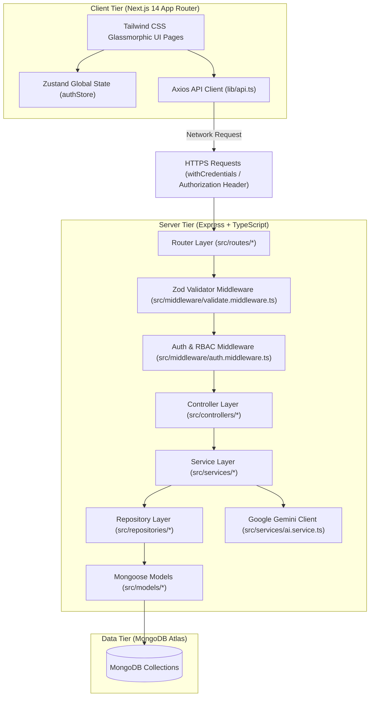

# TerraQuest Technical Explainer & System Guide

Welcome to the **TerraQuest** technical architecture guide. This document serves as a comprehensive system map and explanation companion. It is designed to help you explain the project structure, design patterns, security mechanisms, and coding decisions to **recruiters, engineering managers, or system explainers**.

---

## 🧭 Project Overview: What is TerraQuest?

**TerraQuest** is a premium, high-fidelity travel itinerary planner, hidden gem finder, and local guide marketplace specialized for tourism in India. 

### Key Capabilities
1. **AI Travel Planner**: Leverages Google Gemini (`gemini-1.5-flash`) to generate custom, day-by-day itineraries based on duration, budget, and interests, with an offline fallback engine.
2. **Expense & Budget Tracker**: Manages dynamic trip budgets, tracking expenditures by categories with real-time recalculations.
3. **Local Guides Marketplace**: Enables tourists to search, filter, contact, and review licensed guides, using derived ratings.
4. **Platform Control Center**: A multi-role administrative system permitting user moderation, guide requests approval, and platform metrics monitoring.

---

## 🏛️ System Architecture

TerraQuest is built on a decoupled, modern **MERN (MongoDB, Express, React/Next.js, Node.js) stack** enhanced with **TypeScript** across both layers.



---

## 📁 Codebase Directory Structure

```text
Travell/
├── backend/                  # Server-side Layered Express App (TypeScript)
│   ├── src/
│   │   ├── config/           # Database setup, environment Zod validation
│   │   ├── constants/        # Centralized system roles & enums
│   │   ├── controllers/      # HTTP Request-to-Response mappers
│   │   ├── middleware/       # CORS, Auth, RBAC, Rate-Limiting, Global Error Handler
│   │   ├── models/           # Mongoose schemas (9 Collections)
│   │   ├── repositories/     # Data encapsulation (Repository Pattern)
│   │   ├── routes/           # REST endpoints
│   │   ├── seed/             # Seeding scripts (Guides, Destinations, Admin)
│   │   ├── services/         # Business logic & external APIs (Gemini Integration)
│   │   └── utils/            # Pino logger configurations
│   └── tests/                # Jest integration & unit tests
│
└── frontend/                 # Client-side Next.js 14 App (TypeScript + Tailwind)
    ├── app/                  # App Router Workspace
    │   ├── (auth)/           # Route group for login/register (Custom Split layouts)
    │   ├── (dashboard)/      # Route group for authenticated workspace
    │   │   ├── admin/        # Admin control panels (Moderation, Stats)
    │   │   ├── ai-planner/   # Dynamic AI Trip planner wizard
    │   │   ├── guide/        # Guide profile, requests, and dashboard views
    │   │   ├── trips/        # Trip listing, creation, and expense trackers
    │   │   └── destinations/ # Search, filtering, reviews, and details
    │   └── layout.tsx        # Global font setup & providers
    ├── components/           # Shared UI Layout cards, buttons & loaders
    ├── lib/                  # Axios global instances, interceptors
    └── store/                # Zustand global state configurations
```

---

## 💎 Backend Design Patterns & Technical Concepts

### 1. The Repository Pattern
Instead of calling Mongoose query methods (like `User.findOne`) directly inside controller routes, database operations are encapsulated in classes extending a custom generic class: [BaseRepository](file:///e:/Travell/backend/src/repositories/BaseRepository.ts).

* **Why it's awesome**: It completely decouples database access from business logic. If you decide to migrate from MongoDB to PostgreSQL tomorrow, you only need to rewrite your Repository layer—your Services and Controllers remain unchanged.
* **Implementation example**: Look at [UserRepository](file:///e:/Travell/backend/src/repositories/UserRepository.ts), which extends the base repository to implement security-focused queries like `.select('+password')` explicitly for login validation.

### 2. Service Layer (Separation of Concerns)
Controllers handle parsing the incoming HTTP request payload, returning responses, and handling status codes. All core business algorithms (e.g., verifying bcrypt hashes, signing JWT tokens, generating AI schedules) are contained in dedicated service files (like [auth.service.ts](file:///e:/Travell/backend/src/services/auth.service.ts)).

### 3. Fail-Fast Environment Validation
TerraQuest ensures that the application never runs in an unstable environment. Using **Zod**, the config layer validates all `process.env` properties at application startup:
```typescript
// From backend/src/config/env.ts
const envSchema = z.object({
  PORT: z.string().default('5000').transform((val) => parseInt(val, 10)),
  MONGODB_URI: z.string().min(1, 'MONGODB_URI is required'),
  JWT_SECRET: z.string().min(32, 'JWT_SECRET must be at least 32 characters'),
  FRONTEND_URL: z.string().url().default('http://localhost:3000')
});
```
If a key is missing, the application crashes immediately with a clean print statement, preventing runtime undefined errors.

### 4. Dynamic CORS for Local & Staging Development
To allow seamless local development alongside production environments:
```typescript
// From backend/src/app.ts
app.use(
  cors({
    origin: (origin, callback) => {
      if (!origin) return callback(null, true);
      const isLocalhost = /^http:\/\/localhost:\d+$/.test(origin);
      if (isLocalhost || origin === env.FRONTEND_URL) {
        callback(null, true);
      } else {
        callback(null, false);
      }
    },
    credentials: true,
  })
);
```
This authorizes requests from the production frontend (`env.FRONTEND_URL`) and any local testing port (`localhost:3000`, `3001`, `3002`) dynamically.

### 5. Multi-Layered Authentication & RBAC (Role-Based Access Control)
* **JWT Issuance**: Auth sessions generate a signed JWT storing user ID and role, valid for 7 days.
* **Dual Authorization**: Auth token extraction automatically checks HTTP-Only secure cookies (`accessToken`) first, with a fallback lookup in the `Authorization: Bearer <token>` header (making local CLI, native apps, or header-based HTTP requests fully compatible).
* **RBAC Guard**: Routes are protected by a chain of middleware guards. For example, `authenticate` followed by `authorize('admin')` guarantees type-safe request routing.

---

## 🎨 Frontend Design Patterns & Technical Concepts

### 1. App Router Structure & Layout Isolation
TerraQuest organizes pages using Next.js 14 directory patterns:
* **Route Groups `(auth)` / `(dashboard)`**: Allows structuring logical zones without cluttering URLs. It isolates layouts: auth pages (login/register) don't render global header/footer navigation elements, ensuring clean focus.
* **Suspense Boundaries**: Standardizes loading flows. Pages fetch parameters and query indices under explicit Suspense fallbacks, preventing compilation render blockages.

### 2. State & Token Persistence (Zustand + Axios Interceptors)
* **Zustand Store**: Global state is stored in `authStore.ts`, managing logged-in user profiles, authentication state, and session initialization.
* **Axios Request Interceptor**: Automatically attaches the JWT Bearer Token from `localStorage` to the request header on every client request:
```typescript
api.interceptors.request.use((config) => {
  const token = localStorage.getItem('token');
  if (token) config.headers.Authorization = `Bearer ${token}`;
  return config;
});
```
* **Axios Response Interceptor**: Monitors API responses. If a `401 Unauthorized` status is returned, the interceptor clears local cache credentials automatically and forces page redirection to `/login`.

### 3. Glassmorphic Design System
TerraQuest implements a dark-themed glassmorphism visual layout with the following UX elements:
* **Tilt Glass Cards (`card-3d-wrapper`)**: Interactive dashboard panels that tilt based on hover positions.
* **Spotlight Hover Borders (`card-spotlight`)**: Subtle grid effects where cards trace borders based on pointer locations.
* **Shimmer Skeletons (`skeleton`)**: Pulse animations reflecting card shapes rather than blocking fullscreen indicators.
* **No Emoji Standard**: Uses curated icons (`lucide-react`) combined with precise color tokens (e.g., emerald, sky, violet) for a premium, unified aesthetic.

---

## 📊 Database Indexing & Aggregations

### 1. Text Indexing for Fuzzy Search
To support natural language queries on destinations, MongoDB text indexes are built directly into the Schema:
```typescript
// From backend/src/models/Destination.ts
DestinationSchema.index({ name: 'text', country: 'text', state: 'text', description: 'text' });
```
This enables users to type keywords like "beach" or "Goa" to return matched documents automatically.

### 2. Real-Time Guide Rating Aggregation
Instead of manually calculating averages on page load, a Mongo aggregation pipeline recalculates ratings whenever reviews are updated:
```typescript
// From backend/src/services/rating.service.ts
const stats = await Review.aggregate([
  { $match: { guideId } },
  { $group: { _id: '$guideId', avgRating: { $avg: '$rating' }, totalReviews: { $sum: 1 } } }
]);
```
This recalculates average ratings and stores them back directly on the Guide's profile record, ensuring fast read access.

---

## 🧪 Testing & Validation Philosophy

TerraQuest takes testing seriously to guarantee system stability:
1. **TypeScript compilation**: Strict type checking ensures syntax safety.
2. **Backend Unit & Integration Tests**: 90 Jest assertions cover the REST API, security middleware bounds, and database lifecycle actions. It runs within a lightweight MongoDB memory database (`mongodb-memory-server`) to prevent cluttering development/production databases.
3. **Playwright E2E browser tests**: Validates end-to-end user navigation (registration, authenticating, wizard parameters configuration, and expense additions).

---

## 💬 Interview Q&A Cheatsheet for Recruiters

Here are common interview questions and how you can answer them based on TerraQuest's implementation:

#### Q: "Why did you implement the Repository Pattern instead of using Mongoose models directly in controllers?"
> **Answer**: *"I chose the Repository Pattern to enforce a strict separation of concerns. Using database models directly in controllers couples the API endpoints to a specific ORM/ODM. By encapsulating all database queries into repository classes (like `UserRepository`), the controllers only interact with repositories. This makes the code highly modular, much easier to unit test by mocking the database queries, and keeps controllers clean. If we ever switch to SQL or another ODM, the service and controller layers won't break."*

#### Q: "How did you handle security and session persistence between the client and server?"
> **Answer**: *"Security is managed through a hybrid JWT token scheme. When a user logs in, the backend issues a signed JWT, saving it as an HTTP-Only secure cookie (`accessToken`). This prevents Cross-Site Scripting (XSS) attacks from stealing the token. For local testing or situations where cookies are blocked, the token is also returned in the response body so the frontend Axios client can store it in localStorage and attach it to the `Authorization` header. We also protect our API routes using a custom `authenticate` middleware, and role-based validation handlers like `authorize('admin')` to block unauthorized role elevation."*

#### Q: "What was the most challenging technical hurdle you solved on this project?"
> **Answer**: *"One challenge was configuring CORS to handle local development without breaking production. In production, CORS restricts requests to the Vercel app domain. However, in local development, the frontend might bind to port 3000, 3001, or 3002 depending on port availability. To solve this, I replaced the static CORS origin configuration with a dynamic function regex. It parses the incoming request's Origin, checks if it is a localhost address, or if it matches the env.FRONTEND_URL, and authorizes it on the fly. This resolved local authentication errors while maintaining absolute security in production."*

#### Q: "How did you integrate Gemini AI, and how do you ensure the system is stable if the API limit is hit?"
> **Answer**: *"We integrated Google's Gemini SDK (`gemini-1.5-flash`) in our AI service to generate tailored itineraries. To build a robust system, I implemented a fallback mock generation algorithm. If the Gemini API key is missing or if the request times out or returns an error, the service catches the exception and dynamically creates a structured Markdown travel plan locally based on the user's input. This guarantees that the user always gets a response instead of a crash or 500 server error."*

---

This explainer guide serves as your roadmap for technical reviews. You are ready to present the project structure with high confidence! 🚀
