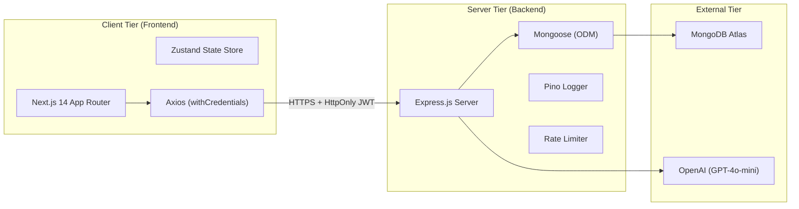

# TerraQuest Tech Stack Analysis

This document provides a detailed breakdown of the technical stack used in the **TerraQuest** application, detailing the design rationale, selection criteria, and rejected alternatives for every tier of the system.

---

## 1. System Architecture Overview

TerraQuest is built on a modern decoupled architecture consisting of an Express-based REST API backend and a Next.js App Router frontend. Communication between the frontend and backend is stateless, secured via HTTP-Only cookies containing JSON Web Tokens (JWT).

---

## 2. Layer-by-Layer Tech Stack Breakdown

### 2.1 Backend Layer (API Tier)

*   **Node.js & Express.js (TypeScript)**
    *   *Purpose*: The core application server, handling HTTP routing, request parsing, authentication checks, and business logic execution.
    *   *Why Chosen*: Node.js provides a non-blocking event-driven loop perfect for handling I/O operations (like communicating with MongoDB or calling the OpenAI API). Express is extremely lightweight and modular, allowing us to enforce clear middleware patterns for validation, authentication, and error handling. TypeScript adds compile-time type safety to prevent runtime exceptions.
    *   *Alternatives Considered & Rejected*:
        *   *Django (Python)*: Rejected due to larger memory footprint and slower startup times. JavaScript/TypeScript matches the frontend stack, allowing models, interfaces, and validation schemas (Zod) to be shared or mirrored.
        *   *Nest.js (TypeScript)*: Rejected for the MVP phase. While highly structured, Nest.js introduces significant boilerplate and decorator complexity that would slow down rapid iteration. A modular Express structure is faster to build and refactor.

*   **Pino & Pino-Pretty**
    *   *Purpose*: Structured JSON logging.
    *   *Why Chosen*: Standard console logging is synchronous and slows down Node.js event loops. Pino is one of the fastest logging libraries in the Node ecosystem and prints structured JSON that can be directly piped into production logging collectors (e.g., Datadog, Loggly, ELK).
    *   *Alternatives Considered & Rejected*:
        *   *Winston*: Rejected because it has a larger memory footprint and is slightly slower than Pino.

### 2.2 Database Tier (Data Persistence)

*   **MongoDB Atlas & Mongoose (ODM)**
    *   *Purpose*: Document database for storing users, trips, destinations, reviews, and AI plans.
    *   *Why Chosen*: TerraQuest manages hierarchical and semi-structured travel datasets (like nested itineraries, varying travelDNA arrays, and polymorphic reviews). Document-based storage matches this data shape natively. Mongoose provides a powerful schema validation layer, middleware hooks (pre/post-save), and built-in typecasting.
    *   *Alternatives Considered & Rejected*:
        *   *PostgreSQL (Relational)*: Rejected because travel plans, itineraries, and user DNA profiles are highly nested, which requires complex joins in a relational database. MongoDB allows us to embed subdocuments (like budget entries) or store dynamic objects without rigid table alterations.

### 2.3 Frontend Layer (Client UI)

*   **Next.js 14 (App Router, React 18, TypeScript)**
    *   *Purpose*: Renders the visual user interface, handles client-side routing, and manages page layout transitions.
    *   *Why Chosen*: Next.js 14 provides built-in SEO capabilities, directory-based routing, server-side pre-rendering, and compilation optimizations. It allows us to structure private dashboard routes (`/(dashboard)`) separate from public routes.
    *   *Alternatives Considered & Rejected*:
        *   *Vite / Create React App (SPA)*: Rejected because SPAs compile to large JavaScript bundles that slow down initial load speeds and hurt search engine optimization (SEO), which is critical for a travel discovery platform.

*   **Tailwind CSS**
    *   *Purpose*: Utility-first styling system.
    *   *Why Chosen*: Tailwind enables rapid UI construction directly in the component tree. Since styles are compiled down to a single optimized stylesheet at build time, it guarantees high performance and responsive layouts without stylesheet bloating.
    *   *Alternatives Considered & Rejected*:
        *   *Styled Components / CSS Modules*: Rejected because they add runtime compilation overhead and make styled assets harder to modularize rapidly across views.

*   **Zustand**
    *   *Purpose*: Global state store for managing user sessions and authentication cookies.
    *   *Why Chosen*: Zustand is extremely lightweight (less than 1KB), requires no complex boilerplate (like Redux actions/reducers), and integrates cleanly with React hooks. It allows us to persist store values directly to localStorage or memory while avoiding server-side hydration mismatches.
    *   *Alternatives Considered & Rejected*:
        *   *Redux Toolkit*: Rejected as overly complex for an application that primarily requires session and simple state synchronization.

### 2.4 Authentication & Security

*   **JSON Web Tokens (JWT) & HTTP-Only Cookies**
    *   *Purpose*: Stateless session verification.
    *   *Why Chosen*: Storing JWTs in localStorage exposes the application to Cross-Site Scripting (XSS) attacks. Moving the token to an HTTP-Only secure cookie ensures that client-side JavaScript cannot read or extract the token, preventing unauthorized account takeovers.
    *   *Alternatives Considered & Rejected*:
        *   *Session ID stored in Redis (Stateful)*: Rejected because it requires maintaining a stateful session store, which increases database load and complicates scale-out architectures. Stateless JWTs scale infinitely.

*   **Express Rate Limit**
    *   *Purpose*: Protects auth routes from brute-force login attacks.
    *   *Why Chosen*: Implements basic request throttling based on client IPs, returning a `429 Too Many Requests` error if a user exceeds the threshold on `/login` or `/register`.
    *   *Alternatives Considered & Rejected*:
        *   *Fail2Ban*: Rejected because configuring OS-level intrusion detection is too heavy for standard platform deployments. Middleware throttling is self-contained.

### 2.5 External Integrations

*   **OpenAI API (GPT-4o-mini)**
    *   *Purpose*: Dynamic generation of travel itineraries based on destination, duration, budget, and traveler interests.
    *   *Why Chosen*: `gpt-4o-mini` is highly optimized, cost-effective, and returns structured markdown schedules in under 10 seconds.
    *   *Alternatives Considered & Rejected*:
        *   *Llama-3 (Self-hosted)*: Rejected because hosting open-source LLMs locally requires massive GPU resources, which is not feasible for a lightweight application stack.
