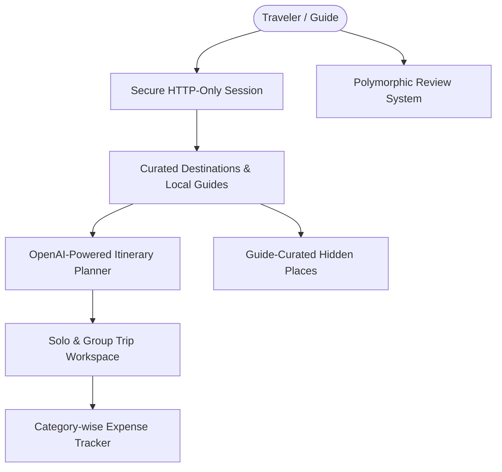

# TerraQuest — Problem Statement & Business Needs Analysis

This document defines the core problem statement, business requirements, traveler-guide engagement goals, and current architectural gaps of the **TerraQuest** travel platform based on the actual codebase implementation.

---

## 1. Business Need & User Requirements

### 1.1 The Problem
Planning a travel experience is often fragmented and tedious. Travelers typically navigate multiple distinct platforms to achieve their goals:
1.  **Inspiration & Discovery**: Browsing travel blogs or destination directories.
2.  **Itinerary Generation**: Utilizing unstructured AI tools (like ChatGPT) or copying static travel guides.
3.  **Group Management**: Coordinating itineraries, participant lists, and roles via messaging apps.
4.  **Financial Tracking**: Monitoring shared group expenses, category breakdowns, and remaining budgets in spreadsheets.
5.  **Local Expert Connection**: Seeking trusted local guides and secret, non-touristy places.

This fragmentation leads to high cognitive load, communication gaps, and budget overruns.

### 1.2 The TerraQuest Solution
TerraQuest consolidates these workflows into a single unified travel ecosystem. 

The system addresses the user needs through the following cohesive features:
*   **Custom Discovery**: Dynamic text-search and tag-filtering of destinations.
*   **AI Planner Wizard**: Converts travel constraints (duration, budget, and interests) into tailored itineraries via OpenAI, which can then be converted into concrete active trips in a single click.
*   **Collaborative Trip Workspace**: Solo and group trip creation where the owner manages member invitations and permissions.
*   **Nested Budget Tracker**: Category-wise expense logging that computes total spent and remaining budget instantly using MongoDB hooks and aggregations.
*   **Guide & Review Hub**: Connects travelers to verified local guides, showcasing guide biographies, ratings, and secret spots ("Hidden Places"), driven by reviews.

---

## 2. Feature Mapping Matrix

The table below maps user requirements to the technical backend/frontend modules implemented in the codebase:

| Business Need | Feature Implementation | Technical Components |
|---|---|---|
| **Secure Sessions** | Credentials Registration & Login | `backend/src/controllers/auth.controller.ts`, HttpOnly secure cookies, JWTs, `express-rate-limit` middleware |
| **Destination Search** | Text & Tag Filters | Mongoose text index on `name` and `activities`, regex country parser in `destination.controller.ts` |
| **Itinerary Generation** | Custom AI planner | OpenAI SDK integration (`gpt-4o-mini`) in `ai.service.ts`, conversion parameters pre-population |
| **Group Coordination** | Group Trips & Members | `Trip` and `TripMember` schemas, owner authorization middleware validation |
| **Financial Tracking** | Nested Budget Tracker | Pre/post-save BudgetEntry Mongoose hooks recalculating `totalSpent` on `Trip` schema |
| **Local Knowledge** | Guide Directories & Secret Spots | `GuideProfile` and `HiddenPlace` collections, reviews aggregation pipeline in `rating.service.ts` |
| **Platform Moderation** | Admin Control Panel | Admin user page `/admin/users`, status toggling, and role modification endpoints |

---

## 3. Identified Gaps & Unresolved Issues (MVP Limitations)

While the P0/P1 scope is fully functional and tested, the following architectural gaps and limitations remain in the current implementation:

### 3.1 Guide Verification Workflow
*   *Current State*: Any user can register as a guide or modify their own role via the guides registration page. There is no background verification, document upload, or administrative approval step.
*   *Business Impact*: Anyone can claim to be a local guide, representing a trust and safety risk for travelers.

### 3.2 Cloudinary Storage Integration
*   *Current State*: Images for destinations, user avatars, and hidden places rely on static URL string fields. While schemas support image arrays, true binary file uploads to Cloudinary are stubbed or pending full frontend integration.
*   *Business Impact*: Users are restricted to pasting external image links rather than uploading photos directly from their devices.

### 3.3 Auth Provider Diversity
*   *Current State*: Only email/password credentials are active. Google OAuth routes exist in specifications but are not active/implemented in the codebase.
*   *Business Impact*: Increased onboarding friction for users preferring quick social logins.

### 3.4 Review Moderation
*   *Current State*: Reviews are published immediately. There is no automated spam filtering, language filtering, or admin flagging mechanism.
*   *Business Impact*: Risk of offensive content or fraudulent ratings impacting guides' reputations.

### 3.5 Granular Group Permissions
*   *Current State*: Only the trip owner can add or remove members, but all members have equal write access to add/delete budget entries.
*   *Business Impact*: Lack of granular roles (e.g., "viewer only" vs "editor") on group trips.
