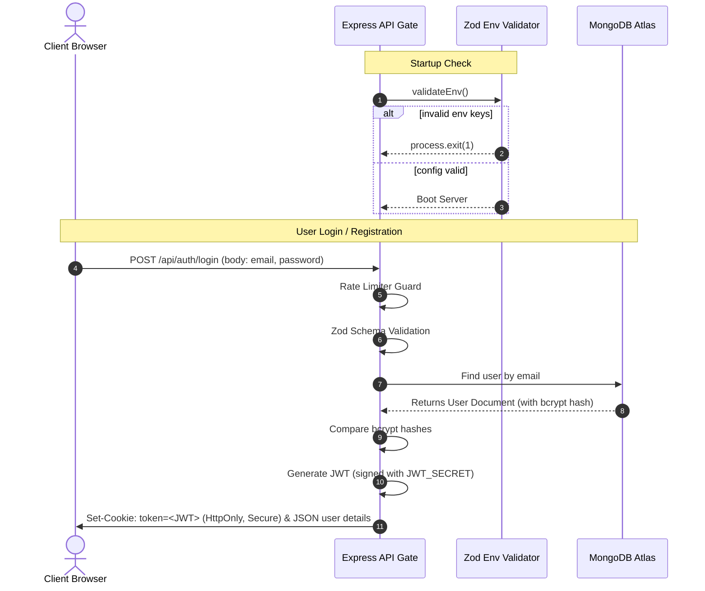

# TerraQuest Phase 1 — Database & Authentication System

This document outlines the detailed architecture, design decisions, code implementation, and step-by-step execution flow of the **Database & Authentication (Phase 1)** system in TerraQuest.

---

## 1. Scope & Objectives
The goal of Phase 1 is to establish a secure database foundation and a stateless session authentication workflow.
*   **Fail-Fast Configuration**: Enforce compile and startup validation on environment configurations.
*   **Structured Persistence**: Create robust Mongoose schemas, type validations, and index pathways in MongoDB Atlas.
*   **Security-First Session Lifecycle**: Implement password hashing (bcrypt), token issuance (JWT), and token transport via HTTP-Only, Secure, SameSite cookies.
*   **Rate Limiting**: Mitigate brute-force credential stuffing attacks on authentication pathways.

---

## 2. Architecture & Data Flow



---

## 3. Tech Stack & Dependencies

*   **zod**: Validates environment objects at startup and request bodies in route middleware.
*   **mongoose**: Provides strict-type schema validation, index declarations, and hooks.
*   **bcryptjs**: Hashes raw passwords before database storage and verifies credentials during login.
*   **jsonwebtoken**: Signs and validates session tokens securely.
*   **cookie-parser**: Extracts JWTs from incoming request cookie headers.
*   **express-rate-limit**: Restricts public auth routes to 5 requests per 15 minutes per IP.

---

## 4. Key Design Decisions & Code Refactoring

### 4.1 Dropping Soft Delete
*   *What Changed*: Soft-delete properties (like `isDeleted` flags and query middlewares) were removed from [User.ts](file:///e:/Travell/backend/src/models/User.ts), [Trip.ts](file:///e:/Travell/backend/src/models/Trip.ts), and [HiddenPlace.ts](file:///e:/Travell/backend/src/models/HiddenPlace.ts).
*   *Why*: Soft deletes complicate query structures (requiring global middleware hooks on `find`, `findOne`, etc.) and break cascading delete requirements. Using Mongoose database-level pre/post hooks for hard deletes ensures absolute referential integrity.
*   *Goal Alignment*: Keeps the codebase simple, clean, and bug-free during rapid development cycles.

### 4.2 Migration to HTTP-Only Secure Cookies
*   *What Changed*: Swapped localStorage-based JWT tokens for secure cookies.
*   *Why*: Storing tokens in localStorage makes them accessible to client-side JavaScript, leaving the app vulnerable to Cross-Site Scripting (XSS). Transporting the JWT via an `HttpOnly`, `Secure`, `SameSite=Lax` cookie prevents JavaScript access and limits Cross-Site Request Forgery (CSRF).
*   *Goal Alignment*: Protects active user sessions against extraction.

### 4.3 Environment Fail-Fast Validation
*   *What Changed*: Integrated [env.ts](file:///e:/Travell/backend/src/config/env.ts) using Zod.
*   *Why*: Prevents the application from starting if critical variables (e.g., `MONGODB_URI`, `JWT_SECRET`) are missing or too short, avoiding silent runtime crashes in production.

---

## 5. Technology Code Breakdown

### 5.1 The User Schema
File: [User.ts](file:///e:/Travell/backend/src/models/User.ts)
*   **Fields**:
    *   `name`: Trimmed string, required.
    *   `email`: Trimmed, lowercase, unique string, validated.
    *   `password`: Minimum 8-character hashed string.
    *   `role`: Enum (`'traveler' | 'guide' | 'admin'`), defaults to `'traveler'`.
    *   `travelDNA`: String array representing travel interests (e.g., `['adventure', 'nature']`).
    *   `isActive`: Boolean tracking account status, defaults to `true`.
    *   `lastLogin`: Date recording the user's last login.
*   **Indexes**:
    *   `email: 1` (unique) for fast profile lookups.
    *   `role: 1` to optimize guide directory queries.
    *   `lastLogin: -1` to sort users by login activity in the admin panel.

### 5.2 The Authentication Service
File: [auth.service.ts](file:///e:/Travell/backend/src/services/auth.service.ts)
Encapsulates business operations for hashing, token signing, and database matching:
```typescript
export async function loginUser(payload: LoginInput) {
  const user = await userRepository.findOne({ email: payload.email });
  if (!user || !user.isActive) {
    throw new AppError('Invalid credentials', 401);
  }
  const isMatch = await bcrypt.compare(payload.password, user.password);
  if (!isMatch) {
    throw new AppError('Invalid credentials', 401);
  }
  
  // Track login timestamp
  user.lastLogin = new Date();
  await user.save();

  const token = jwt.sign({ id: user._id, role: user.role }, env.JWT_SECRET, {
    expiresIn: env.JWT_EXPIRES_IN,
  });

  return { token, user };
}
```

---

## 6. Execution Flow & Step-by-Step Working

### 6.1 Register Flow (`POST /api/auth/register`)
1.  **Input Parse**: Zod schema parses request body keys: `name`, `email`, `password`, `role`.
    *   *Constraint*: Email must be valid; password must be at least 8 characters.
2.  **Duplicate Check**: AuthService queries user collection for the email.
    *   *Error Case*: If found, throws `409 Conflict` ("Email already exists").
3.  **Password Hash**: Password string is hashed via `bcrypt.hash` with 10 salt rounds.
4.  **Creation**: User record is saved.
5.  **Token Generation**: JWT is signed using `{ id, role }`.
6.  **Response**: The server writes the token to the `token` cookie with `httpOnly: true`, `secure: process.env.NODE_ENV === 'production'`, `sameSite: 'lax'`, and returns `201 Created` with the user profile object.

### 6.2 Login Flow (`POST /api/auth/login`)
1.  **Input Parse**: Validates email and password formats.
2.  **User Verification**: Finds the user document.
    *   *Error Case*: If missing or `isActive === false`, throws `401 Unauthorized`.
3.  **Hash Verification**: Calls `bcrypt.compare` on the password and hashed password.
    *   *Error Case*: If verification fails, throws `401 Unauthorized`.
4.  **Login Tracking**: Updates the `lastLogin` timestamp on the User document.
5.  **Token Generation**: Signs and sets the JWT in the response cookie; returns `200 OK`.

---

## 7. Edge Cases & Error Handling

*   **Deactivated Accounts**: If an admin sets `isActive: false` on a user, subsequent login requests throw a `401 Unauthorized` error immediately.
*   **Weak Secret Mitigation**: Zod enforces `JWT_SECRET` to be at least 32 characters long at startup, preventing weak token signatures.
*   **Cookie Parser Fallback**: The auth middleware extracts the JWT from the `Authorization` header (`Bearer <JWT>`) if cookies are disabled, ensuring API flexibility.

---

## 8. Verification & Environments

### 8.1 Automated Tests
Run integration tests checking JWT generation, registration failures, and cookie setting:
```bash
npm run test backend/tests/integration/auth.integration.test.ts
```

### 8.2 Environment Checklist
Ensure `.env` contains:
```env
PORT=5000
NODE_ENV=development
MONGODB_URI=mongodb://localhost:27017/terraquest
JWT_SECRET=super_secret_key_that_is_at_least_32_chars_long
JWT_EXPIRES_IN=7d
FRONTEND_URL=http://localhost:3000
```
