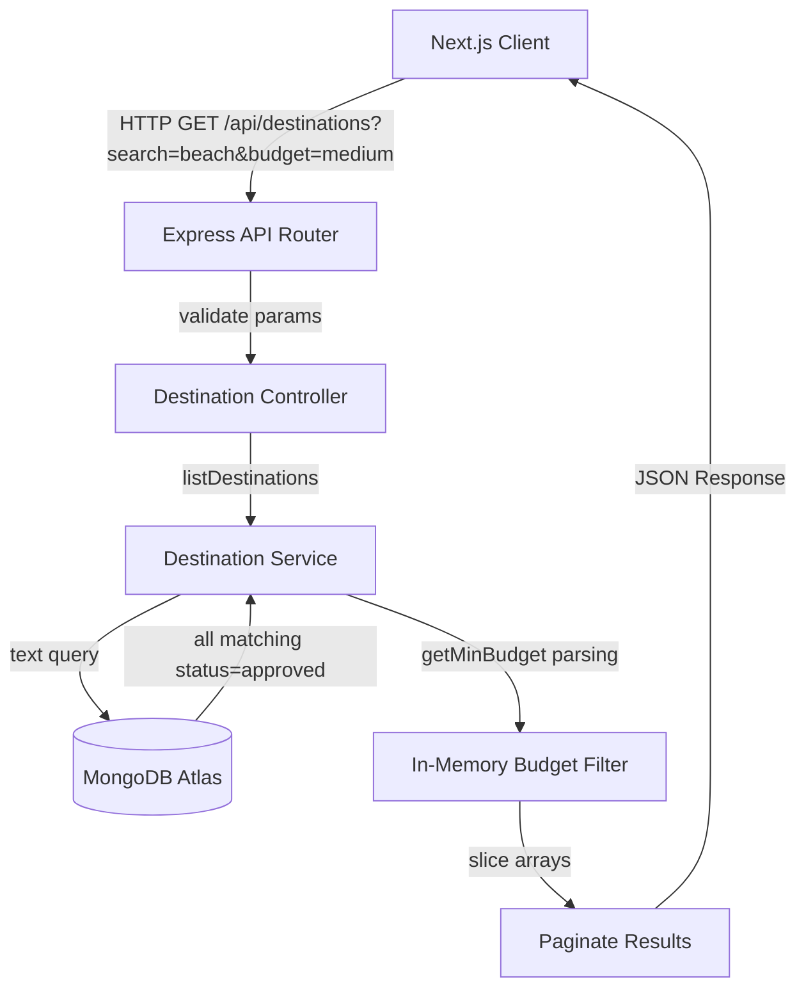

# TerraQuest Phase 2 — Destinations Catalog & Search System

This document provides a comprehensive technical overview of the **Destinations Catalog & Search (Phase 2)** system in TerraQuest.

---

## 1. Scope & Objectives
The goal of Phase 2 is to implement a high-performance destination discovery interface.
*   **Search Engine**: Enable full-text search capability across destinations.
*   **Dynamic Filtering**: Support case-insensitive tag matching for travel activities and budget range classifications.
*   **Secure Submissions**: Allow local guides to submit destination contributions which default to a `pending` status.
*   **Optimized Client Routing**: Prevent static compilation failures in Next.js when reading client query parameters.

---

## 2. Architecture & Data Flow



---

## 3. Tech Stack & Integrations

*   **MongoDB Text Search**: Mongoose schema text indexes enable scoring and matching.
*   **Zod schema validation**: Used to structure guide submissions.
*   **React Suspense**: Wraps client search pages on the frontend, handling dynamic browser navigation state.

---

## 4. Key Design Decisions

### 4.1 Hybrid Database-In-Memory Filtering
*   *Design*: The text query (`search`) and activities filters are executed directly in the database using MongoDB query selectors, while the budget-bracket filter (`low`, `medium`, `high`) is resolved in-memory.
*   *Rationale*: Destinations store budget ranges as descriptive string formats (e.g., `"$1,500 - $2,500"`). A regular database range query would fail due to string characters. Extracting the numeric minimum budget from the string in-memory allows us to categorize budgets cleanly without introducing complex schema schemas.

### 4.2 Suspense Isolation
*   *Design*: Wrapped components using `useSearchParams()` in a `<Suspense>` boundary on the frontend.
*   *Rationale*: During `next build`, Next.js tries to statically optimize pages. If a page calls `useSearchParams` outside a Suspense component, the builder crashes because search parameters are only available at request time. Wrapping the explorer workspace in Suspense prevents build failures.

---

## 5. Technology Code Breakdown

### 5.1 Text Indexes & Schema
File: [Destination.ts](file:///e:/Travell/backend/src/models/Destination.ts)
The schema defines a compound text index:
```typescript
DestinationSchema.index({ name: 'text', activities: 'text' });
```
This index allows the database to rank and return destinations matching user keywords in the `name` or `activities` array.

### 5.2 Budget Range Parser
File: [destination.service.ts](file:///e:/Travell/backend/src/services/destination.service.ts)
The helper extracts integers from dynamic budget ranges:
```typescript
const getMinBudget = (range: string): number => {
  const cleanRange = range.replace(/,/g, '');
  const match = cleanRange.match(/\d+/);
  return match ? parseInt(match[0], 10) : 0;
};
```
If the database contains `"$2,500 - $3,500"`, the parser cleans the commas and matches `2500` as the minimum budget.

### 5.3 Filter Mapping
The service filters records matching the parsed minimum budget:
*   `low`: `minBudget < 2500`
*   `medium`: `minBudget >= 2500 && minBudget < 4000`
*   `high`: `minBudget >= 4000`

---

## 6. Execution Flow & Step-by-Step Working

### 6.1 Explore Search Flow (`GET /api/destinations`)
1.  **Request Input**: The client requests `/api/destinations?search=Iceland&activity=hiking&budget=high&page=1&limit=5`.
2.  **Filter Construction**:
    *   Set `query.status = 'approved'` (excludes pending guide drafts).
    *   If `search` is provided, append `$text: { $search: search }` to query.
    *   If `activity` is provided, construct a case-insensitive regex: `query.activities = { $regex: new RegExp(activity, 'i') }`.
3.  **Database Fetch**: Queries the database using the constructed `query` filters.
4.  **In-Memory Budget Filter**: Filters the database results using the parsed `minBudget` threshold:
    *   ` Iceland` returns budget `"$5,000"`.
    *   `minBudget` = `5000`. Matches `high` (>= 4000). Retained.
5.  **Pagination Calculation**:
    *   `total` = 1 matching record.
    *   `totalPages` = `Math.ceil(1 / 5)` = 1.
    *   `startIndex` = `(1 - 1) * 5` = 0.
    *   `paginatedDestinations` = `destinations.slice(0, 5)`.
6.  **Response**: Returns a `200 OK` JSON response containing the matching destinations array and pagination metadata.

---

## 7. Edge Cases & Error Handling

*   **Special Characters in Search**: Queries with punctuation are cleaned by MongoDB's native text parser.
*   **Malformed Budget Range Strings**: If a destination has no budget value or a bad string (e.g., `"TBD"`), `getMinBudget` defaults to `0`, categorizing it under the `low` budget tier.
*   **Out of Bound Pagination**: If a page request exceeds `totalPages`, the service returns an empty `destinations` array rather than throwing an error, facilitating smooth frontend infinite scrolls or empty states.

---

## 8. Verification & Validation Strategy

### 8.1 Automated Tests
Run integration tests asserting text search scores and regex match rules:
```bash
npm run test backend/tests/integration/destination.integration.test.ts
```

### 8.2 Seeding Verification
Ensure the catalog database is populated:
```bash
npm run seed
```
This script populates 10 destinations including budget formats and activity arrays.
