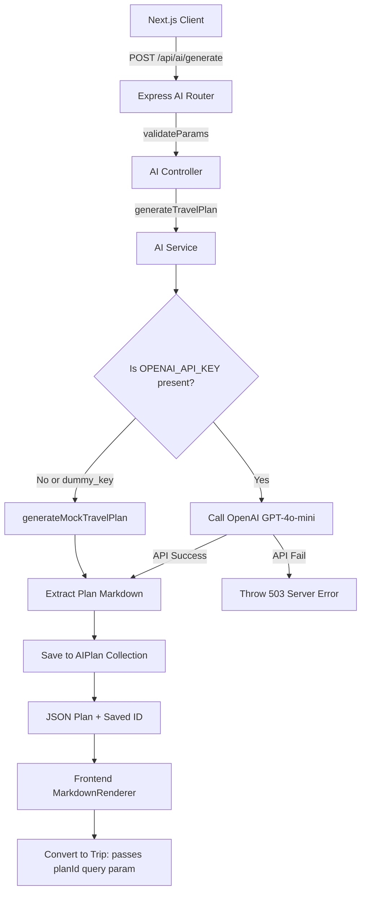

# TerraQuest Phase 4 — AI Travel Itinerary Planner System

This document outlines the detailed architecture, design decisions, fallback systems, and step-by-step execution flow of the **AI Planner (Phase 4)** in TerraQuest.

---

## 1. Scope & Objectives
Phase 4 leverages generative artificial intelligence to streamline itinerary planning:
*   **Prompt-Driven Itineraries**: Generate detailed day-by-day travel schedules based on budget, duration, destination, and user interests.
*   **Zero-Downtime Fallback**: Guarantee system availability with local mock generators when the OpenAI service is offline or credentials are missing.
*   **One-Click Conversion**: Allow users to seamlessly convert AI plans into active trips, pre-filling destination, date, and budget details.

---

## 2. Architecture & Data Flow



---

## 3. Key Design Decisions

### 3.1 Graceful Offline Fallbacks
*   *Design*: If the `OPENAI_API_KEY` is undefined, matches `'dummy_key'`, or fails validation, the service automatically calls `generateMockTravelPlan(input)`.
*   *Rationale*: Travel planning requests are highly complex and network-dependent. Integrating a local procedural markdown generator ensures that developer sandboxes run without API keys, and production builds stay resilient against OpenAI service disruptions.
*   *Goal Alignment*: Supports rapid local testing and offline capability.

### 3.2 Parameterized Conversion Pathway
*   *Design*: When a user clicks "Convert to Trip" on a generated plan, the UI redirects to `/trips/new?planId=<saved_id>&destinationId=<dest_id>&budget=<budget>&duration=<duration>`.
*   *Rationale*: Transitioning from a read-only AI plan to a collaborative group trip shouldn't require manual re-typing. Pre-populating query parameters allows the Next.js form builder to pre-fill the fields.
*   *Goal Alignment*: Enhances the traveler onboarding experience.

---

## 4. Technology Code Breakdown

### 4.1 OpenAI Completion Parameters
File: [ai.service.ts](file:///e:/Travell/backend/src/services/ai.service.ts)
The OpenAI call utilizes the optimized `gpt-4o-mini` model with specific instructions:
```typescript
const response = await openai.chat.completions.create({
  model: 'gpt-4o-mini',
  messages: [{ role: 'user', content: prompt }],
  max_tokens: 1500,
  temperature: 0.7,
});
```
*   `model: 'gpt-4o-mini'`: Chosen for speed, cost-effectiveness, and reliable markdown output.
*   `temperature: 0.7`: Provides a balance between creative activity suggestions and realistic budget estimates.
*   `max_tokens: 1500`: Ensures sufficient headroom to return a complete, multi-day itinerary.

### 4.2 Dynamic Prompt Generation
The prompt structures constraints clearly to guide the LLM:
```typescript
const prompt = `
You are an expert travel planner for India.
Create a detailed ${input.duration}-day travel itinerary for ${input.destinationName}.
Constraints:
- Total budget: ₹${input.budget}
- Traveler interests: ${input.interests.join(', ')}

Provide:
1. Day-by-day schedule
2. Accommodation suggestions
3. Food recommendations (local eats)
...
`;
```

---

## 5. Execution Flow & Step-by-Step Working

### 5.1 Plan Generation Flow (`POST /api/ai/generate`)
1.  **Form Submission**: The traveler fills out fields for Destination, Budget, Duration, and selects Interest chips (e.g., `['nature', 'adventure']`).
2.  **API Routing**: Request hits `POST /api/ai/generate` with JWT authentication.
3.  **Service Resolution**:
    *   If the system is running offline or lacks API keys, `generateMockTravelPlan` processes the input parameters and outputs a structured template containing customized day schedules matching the interest tags.
    *   If online, the service queries `gpt-4o-mini` with the formatted travel prompt.
4.  **Database Cache**: The backend saves the output to the `AIPlan` collection:
    *   Includes `userId`, `destinationId`, `duration`, `budget`, `interests`, and the raw `itinerary` markdown string.
5.  **Frontend Render**: The client receives the JSON payload. The frontend uses a custom MarkdownRenderer component to display the itinerary with styling for headings, bullet points, and tables.

---

## 6. Edge Cases & Error Handling

*   **API Key Failures**: If the OpenAI key is invalid, the backend intercepts the network error, logs the failure structure using the Pino structured logger, and returns a `503 Service Unavailable` status code to the client.
*   **Extreme Duration Configurations**: If a traveler inputs an invalid duration (e.g., `< 1` or `> 30` days), Zod schemas reject the request before calling the LLM.
*   **Access Violations**: The `GET /api/ai/plans/:id` route checks that the requesting `userId` matches the plan's `userId`, preventing unauthorized users from viewing private itineraries.

---

## 7. Verification & Environments

### 7.1 Integration Tests
Run integration tests asserting OpenAI connection error interceptions and mock generator outcomes:
```bash
npm run test backend/tests/integration/ai.integration.test.ts
```
This suite asserts plan generation, database storage, and access authorization checks.
