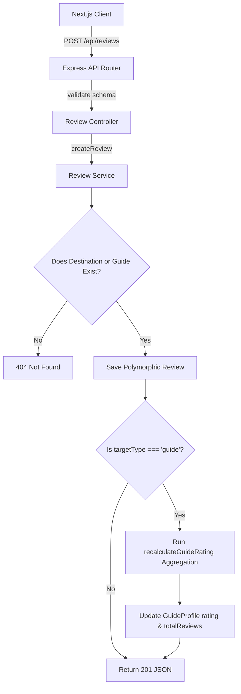

# TerraQuest Phase 5 — Polymorphic Review & Guide Rating System

This document outlines the detailed architecture, database design patterns, rating aggregates calculation, and step-by-step execution flow of the **Polymorphic Review & Guide Ratings (Phase 5)** system in TerraQuest.

---

## 1. Scope & Objectives
Phase 5 introduces feedback tracking and rating scorecards:
*   **Polymorphic Feedback**: Implement a single, clean database model capable of tracking reviews for both physical locations (Destinations) and active users (Guides).
*   **Dynamic Rating Sync**: Automatically recalculate average rating metrics and total review counts when review activities occur.
*   **Guide Analytics**: Persist and cache rating indicators on Guide Profiles, enabling fast searching and location filtering.

---

## 2. Architecture & Data Flow



---

## 3. Key Design Decisions

### 3.1 Polymorphic Database Pattern
*   *Design*: Instead of creating separate database tables/collections (such as `DestinationReview` and `GuideReview`), TerraQuest uses a single polymorphic `Review` collection. It identifies the target using a compound mapping of two fields:
    *   `targetId`: The unique ID of the target document.
    *   `targetType`: A string indicator restricted to `'destination'` or `'guide'`.
*   *Rationale*: This design keeps the database schema DRY, simplifies index management, and allows the frontend to share the same feedback list layout.

### 3.2 Cached Rating Metrics
*   *Design*: Store `rating` and `totalReviews` as cached properties directly inside the `GuideProfile` schema rather than calculating them dynamically on page load.
*   *Rationale*: Displaying guide cards in list views is a high-frequency read operation. Calculating average ratings on demand would require scanning the entire reviews collection for every guide in the list, causing performance issues. Caching the values enables fast read times (\(O(1)\)).

---

## 4. Technology Code Breakdown

### 4.1 The Polymorphic Indexes
File: [Review.ts](file:///e:/Travell/backend/src/models/Review.ts)
A compound index is configured on the target mapping to optimize lookups:
```typescript
ReviewSchema.index({ targetId: 1, targetType: 1 });
```
This compound index enables the database to resolve queries like "retrieve all reviews for Destination X" or "retrieve all reviews for Guide Y" in millisecond time scales.

### 4.2 The Aggregation Pipeline
File: [rating.service.ts](file:///e:/Travell/backend/src/services/rating.service.ts)
The pipeline isolates reviews matching the target ID and role, calculates the average, and counts total entries:
```typescript
export const recalculateGuideRating = async (guideId: string | mongoose.Types.ObjectId) => {
  const result = await reviewRepository.aggregate([
    {
      $match: {
        targetId: new mongoose.Types.ObjectId(guideId),
        targetType: 'guide',
      },
    },
    {
      $group: {
        _id: '$targetId',
        avgRating: { $avg: '$rating' },
        count: { $sum: 1 },
      },
    },
  ]);

  const avgRating = result[0]?.avgRating ?? 0;
  const count = result[0]?.count ?? 0;

  await guideRepository.updateOne(
    { userId: new mongoose.Types.ObjectId(guideId) },
    {
      rating: Math.round(avgRating * 10) / 10,
      totalReviews: count,
    }
  );
};
```
*   `$avg: '$rating'`: Aggregates the mathematical average.
*   `Math.round(avgRating * 10) / 10`: Rounds the average value to one decimal place (e.g., `4.3`).
*   `userId: guideId`: Dynamically maps the calculated metrics back to the guide's profile.

---

## 5. Execution Flow & Step-by-Step Working

### 5.1 Submitting a Guide Review (`POST /api/reviews`)
1.  **Request Input**: A traveler posts a review payload: `{ targetId: 'user_guide_123', targetType: 'guide', rating: 5, comment: 'Amazing guide!' }`.
2.  **Target Verification**:
    *   The service checks the `GuideProfile` collection using `targetId`.
    *   *Error Case*: If the profile is missing, it throws a `404 Not Found` error.
3.  **Review Creation**: Saves the document into the polymorphic `Review` collection.
4.  **Rating Synchronization**:
    *   Since `targetType` is `'guide'`, the service triggers `recalculateGuideRating('user_guide_123')`.
    *   The pipeline groups all reviews where `targetId === 'user_guide_123'` and `targetType === 'guide'`.
    *   The database updates the guide's cached `rating` and `totalReviews`.
5.  **Response**: Returns the created review object to the client (`201 Created`).

---

## 6. Edge Cases & Error Handling

*   **Reviewing Non-Existent Entities**: The service validates references prior to insertion. If a user attempts to review a nonexistent destination or guide ID, the check fails with a `404 Not Found` error.
*   **Guide Profiles with Zero Reviews**: If all reviews for a guide are deleted, the aggregation returns an empty array. The code handles this edge case by defaulting `avgRating` and `count` to `0`, preventing runtime errors.
*   **Score Bounds Enforcement**: Zod validations reject ratings below `1` or above `5` before any database action occurs.

---

## 7. Verification & Validation Strategy

### 7.1 Integration Tests
Run integration tests asserting polymorphic structures, validation failures, and aggregation math:
```bash
npm run test backend/tests/integration/review.integration.test.ts
npm run test backend/tests/integration/guide.integration.test.ts
```
This suite verifies that reviews are saved correctly and guide ratings are updated accurately.
