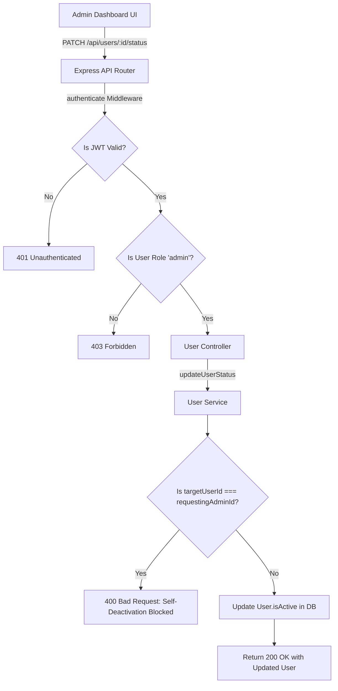

# TerraQuest Phase 6 — Administrative Features & Control System

This document outlines the detailed architecture, design decisions, security safeguards, and execution flow of the **Administrative Features (Phase 6)** system in TerraQuest.

---

## 1. Scope & Objectives
Phase 6 delivers centralized user management capabilities:
*   **User Directory**: Provide admins with a listing of all registered users, including their roles, active status, creation dates, and last login times.
*   **Access Control**: Enable admins to toggle the `isActive` state of user accounts, instantly blocking deactivated users from logging in or making API requests.
*   **Role Management**: Allow upgrading or downgrading user privileges (e.g., promoting a Traveler to a Guide or Admin).
*   **System Safeguards**: Prevent administrative users from locked-out states through self-deactivation or self-role downgrades.

---

## 2. Architecture & Data Flow



---

## 3. Key Design Decisions & Safety Controls

### 3.1 Self-Modification Safeguards
*   *Design*: The service layer intercepts role and status changes to verify the target user:
```typescript
if (targetUserId === requestingAdminId) {
  throw new AppError('Forbidden: You cannot deactivate your own account', 400);
}
```
*   *Rationale*: If an administrator accidentally toggles their own account status to `inactive` or updates their role from `admin` to `traveler`, they would instantly lock themselves out of the control panel with no way to revert the change. This safeguard prevents accidental lockouts.

### 3.2 Login Indexing & Tracking
*   *Design*: We index the `lastLogin` field:
```typescript
UserSchema.index({ lastLogin: -1 });
```
And update it during authentication:
```typescript
user.lastLogin = new Date();
await user.save();
```
*   *Rationale*: This index supports sorting the user list by recent activity, helping administrators monitor active users.

---

## 4. Technology Code Breakdown

### 4.1 Admin Route Enforcements
File: [user.routes.ts](file:///e:/Travell/backend/src/routes/user.routes.ts)
The administrative routes are protected by a chain of middleware:
```typescript
router.get('/', authenticate, role('admin'), userController.getAllUsers);
router.patch('/:id/status', authenticate, role('admin'), userController.updateUserStatus);
router.patch('/:id/role', authenticate, role('admin'), userController.updateUserRole);
```
1.  `authenticate`: Validates the cookie JWT and attaches the user payload to `req.user`.
2.  `role('admin')`: Verifies that `req.user.role === 'admin'`. If not, blocks the request with a `403 Forbidden` response.

---

## 5. Execution Flow & Step-by-Step Working

### 5.1 Deactivating a User (`PATCH /api/users/:id/status`)
1.  **Request Input**: Admin sends a status change payload: `{ isActive: false }` to `/api/users/667ef11bc32/status`.
2.  **Authentication & Role Check**:
    *   Auth middleware extracts the JWT.
    *   Role middleware verifies the requester is an admin.
3.  **Self-Deactivation Check**:
    *   The service checks if the target `id` (`667ef11bc32`) matches the logged-in admin's ID.
    *   *Error Case*: If they match, the request fails with a `400 Bad Request` error.
4.  **Database Write**:
    *   Queries `User` collection.
    *   Updates the `isActive` boolean value to `false`.
5.  **Response**: Returns the updated user document.
    *   The frontend table updates the user's status indicator inline. If the deactivated user tries to make a subsequent request, the auth middleware will reject them.

---

## 6. Edge Cases & Error Handling

*   **Self-Role Downgrades**: If an admin attempts to change their own role to traveler, the service blocks the request with a `400 Bad Request` error.
*   **Updating Non-Existent User IDs**: If the target `id` does not exist in the database, the service throws a `404 Not Found` error.
*   **Input Validation Failures**: Toggling status with non-boolean values (e.g. `isActive: "disabled"`) throws a `400 Bad Request` error.

---

## 7. Verification & Validation Strategy

### 7.1 Automated Tests
Run integration tests asserting role guards, status toggles, and self-modification blocks:
```bash
npm run test backend/tests/integration/auth.integration.test.ts
```
This suite verifies user listing, status updates, role updates, and self-deactivation limits.
