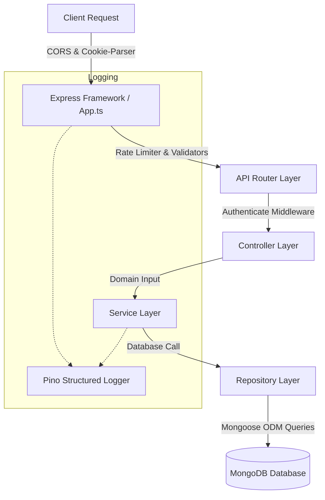

# TerraQuest — Production Refactoring & Security Architecture

This document details the refactoring initiatives, repository abstractions, logging configurations, and security policies implemented during the production hardening phase of TerraQuest.

---

## 1. Scope & Objectives
The goal of this refactoring phase is to prepare the TerraQuest codebase for production-level scalability, maintainability, and security:
*   **Service-Repository Abstraction**: Isolate database-access patterns (Mongoose queries) from business rules, facilitating easier testing and domain modifications.
*   **Structured Performance Logging**: Implement a high-performance structured JSON logging system (Pino) to replace standard synchronous, blocking `console.log` statements.
*   **API Throttling & Security Policy**: Enforce rate-limiting boundaries on public authentication routes, cookies configurations, and strict Cross-Origin Resource Sharing (CORS) rules.

---

## 2. Architectural Abstraction Layers



---

## 3. Key Design Decisions

### 3.1 Service-Repository Pattern
*   *Design*: Database interactions are isolated in a repository layer (e.g., `UserRepository`, `TripRepository`) which extends a generic `BaseRepository<T extends Document>` class. Business logic, password encryption, and API conversions are handled in the service layer (e.g., `auth.service.ts`, `budget.service.ts`). Controllers only handle parsing inputs and returning responses.
*   *Rationale*: This decoupling separates concerns. Changing database layers (e.g., swapping Mongoose for Prisma or MongoDB for PostgreSQL) only requires modifying the repository classes, leaving the core services untouched.
*   *Goal Alignment*: Standardizes clean-code design.

### 3.2 High-Performance Pino Logging
*   *Design*: Integrates the `pino` structured logger. Prints human-readable, colorized output in development environments via `pino-pretty`, and outputs standard serialized JSON streams in production.
*   *Rationale*: Synchronous logs (`console.log`) block the Node.js event loop, which degrades performance. Pino uses asynchronous, non-blocking streams and structured JSON formats that can be easily parsed by log aggregation tools (e.g., Datadog, ELK).

### 3.3 Defense-in-Depth Security
*   *Rate Limiting*: Public authentication endpoints (`/register`, `/login`) are guarded by `authRateLimiter` to prevent brute-force attacks.
*   *CORS Restriction*: CORS limits origins strictly to `env.FRONTEND_URL`, which prevents unauthorized websites from reading or modifying API resources.
*   *Cookie Policies*: Session JWTs are transported in secure cookies with `httpOnly: true`, `secure: true` (in production), and `sameSite: 'lax'` attributes to mitigate XSS and CSRF attacks.

---

## 4. Technology Code Breakdown

### 4.1 The Generic Base Repository
File: [BaseRepository.ts](file:///e:/Travell/backend/src/repositories/BaseRepository.ts)
The base class exposes standard Mongoose operations using generic parameters:
```typescript
export class BaseRepository<T extends Document> {
  constructor(protected readonly model: Model<T>) {}

  async create(data: any): Promise<T> {
    return this.model.create(data);
  }

  async findById(id: string | any, projection?: any, options?: QueryOptions): Promise<T | null> {
    return this.model.findById(id, projection, options);
  }

  async updateById(id: string | any, update: UpdateQuery<T>, options: any = { new: true }): Promise<T | null> {
    return this.model.findByIdAndUpdate(id, update, options) as any;
  }
  // Exposes findOne, find, deleteById, deleteMany, aggregates, and more.
}
```

### 4.2 Logging Configuration
File: [logger.ts](file:///e:/Travell/backend/src/utils/logger.ts)
The logger adapts its output format based on the environment:
```typescript
export const logger = pino({
  level: env.NODE_ENV === 'production' ? 'info' : 'debug',
  transport: env.NODE_ENV !== 'production' ? {
    target: 'pino-pretty',
    options: {
      colorize: true,
      ignore: 'pid,hostname',
      translateTime: 'SYS:standard',
    }
  } : undefined
});
```

---

## 5. Request-to-Database Execution Flow

### 5.1 Registration Request Security Flow
1.  **Request Arrival**: A client posts a request to `/api/auth/register`.
2.  **CORS Handshake**: Express verifies the request origin against `FRONTEND_URL`.
3.  **Rate Limiter check**: `authRateLimiter` increments the request count for the client's IP. If it exceeds 5 requests per 15 minutes, it returns `429 Too Many Requests`.
4.  **Zod Parsing**: The Zod validator checks the payload. If valid, the request proceeds to the auth controller.
5.  **Service Business Layer**: The controller forwards the request to `auth.service.ts`. The service handles password hashing and session generation.
6.  **Repository Persistence**: The service calls `userRepository.create()`, which executes the Mongoose operation.
7.  **Cookie Delivery**: The controller sets the JWT in the response cookie and returns the user object.
8.  **Logging**: The event is logged in JSON format.

---

## 6. Edge Cases & Error Handling

*   **Database Down Time**: If the database is offline, repository calls fail. The global error handler catches these Mongoose exceptions, logs the error stack trace, and returns a `500 Internal Server Error` to prevent leaking raw database error logs to the client.
*   **Testing Rate Limits**: During unit and integration testing, rate limits are automatically relaxed (`max: 1000`) in `rateLimiter.ts` to prevent tests from failing due to rate limiting.
*   **XSS Mitigation**: The frontend is prevented from accessing the session token because it is stored in an `HttpOnly` cookie.

---

## 7. Verification & Environments

Run the backend integration test suites to verify repository queries, error handlers, and middleware boundaries:
```bash
npm run test
```
All repository patterns, controllers, and services are validated in-memory to ensure correct behavior.
