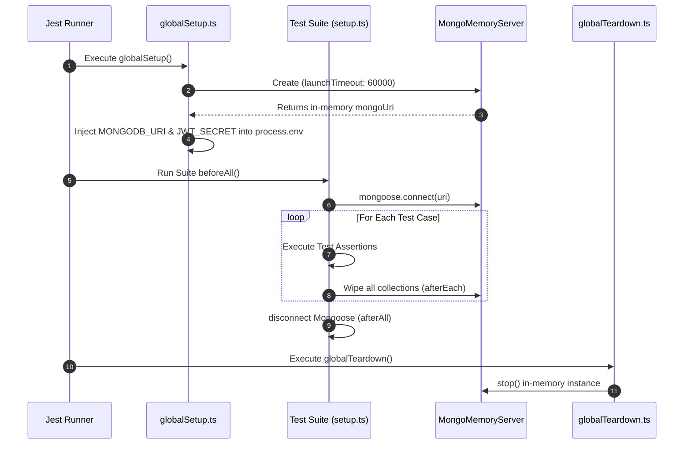

# TerraQuest Phase 9 — Testing & Deployment Strategy

This document outlines the detailed architecture, test configuration files, deployment checklists, and future scalability guidelines of the **Testing & Deployment (Phase 9)** framework in TerraQuest.

---

## 1. Scope & Objectives
Phase 9 guarantees application stability, automated verification, and production readiness:
*   **Wired Verification**: Implement an in-memory integration test suite to validate all controllers, services, and repository layers without mutating real databases.
*   **Cross-Environment Compatibility**: Optimize test setups to run reliably on Windows, macOS, and Linux CI platforms.
*   **Production Deployment Plan**: Define deployment pathways for Next.js (Vercel) and the Express Backend (Railway or Render).
*   **Scalability Blueprint**: Outline database replica configurations and Redis caching blueprints for production growth.

---

## 2. Testing Architecture & Lifecycle



---

## 3. Key Design Decisions

### 3.1 In-Memory Database Isolation
*   *Design*: The test runner does not connect to a local or staging MongoDB database. Instead, it starts a dedicated instance of `mongodb-memory-server` before running any tests.
*   *Rationale*: Prevents tests from mutating developer databases, eliminates network latency during testing, and guarantees clean test state through collection-wipe hooks between test runs.
*   *Goal Alignment*: Supports rapid, isolated, and repeatable test executions.

### 3.2 Mitigation of Windows MMS Startup Timeouts
*   *Design*: Configured a timeout threshold inside [globalSetup.ts](file:///e:/Travell/backend/tests/globalSetup.ts):
```typescript
process.env.MONGOMS_STARTUP_TIMEOUT = '60000';
// ...
const mongoServer = await MongoMemoryServer.create({
  instance: { launchTimeout: 60000 },
});
```
*   *Rationale*: On some platforms (such as Windows sandboxes or virtualized environments), downloads and initial setups of MongoMemoryServer binaries take longer than Jest's default 10-second timeout. Increasing this threshold prevents false-positive startup timeouts.
*   *Goal Alignment*: Ensures test reliability across diverse development environments.

---

## 4. Testing Code Breakdown

### 4.1 Global Setup Configuration
File: [globalSetup.ts](file:///e:/Travell/backend/tests/globalSetup.ts)
Initializes the in-memory server and exports environment variables:
```typescript
export default async function globalSetup() {
  const mongoServer = await MongoMemoryServer.create({
    instance: { launchTimeout: 60000 },
  });
  const mongoUri = mongoServer.getUri();

  global.__MONGO_SERVER__ = mongoServer;
  process.env.MONGODB_URI = mongoUri;
  process.env.JWT_SECRET = 'test-jwt-secret-that-is-long-enough-32chars!';
  process.env.NODE_ENV = 'test';
}
```

### 4.2 Database Isolation Setup
File: [setup.ts](file:///e:/Travell/backend/tests/setup.ts)
Ensures database cleanliness between individual tests:
```typescript
// Wipe all collections after each test for isolation
afterEach(async () => {
  const collections = mongoose.connection.collections;
  for (const key in collections) {
    await collections[key].deleteMany({});
  }
});
```

---

## 5. Deployment Guidelines

### 5.1 Backend Deployment (Railway or Render)
1.  **Repository Setup**: Link the `backend/` directory to the platform.
2.  **Build Command**: `npm run build` (compiles TypeScript to `dist/`).
3.  **Start Command**: `npm start` (runs `node dist/server.js`).
4.  **Environment Variables**:
    *   `PORT`: `5000` (automatically managed by Railway).
    *   `NODE_ENV`: `production`
    *   `MONGODB_URI`: Connection string to your MongoDB Atlas cluster.
    *   `JWT_SECRET`: Production-grade cryptographically secure secret.
    *   `FRONTEND_URL`: URL of the deployed frontend (e.g. `https://terraquest.vercel.app`).

### 5.2 Frontend Deployment (Vercel)
1.  **Project Root**: Set root directory to `frontend/`.
2.  **Framework Preset**: `Next.js`.
3.  **Build Command**: `next build`.
4.  **Output Directory**: `.next`.
5.  **Environment Variables**:
    *   `NEXT_PUBLIC_API_URL`: URL of your deployed backend (e.g. `https://terraquest-api.railway.app`).

---

## 6. Future Scalability Considerations

To scale TerraQuest beyond MVP levels, the following infrastructure changes are recommended:
1.  **Redis Cache Integration**: Deploy a Redis instance to cache high-frequency read operations, such as destination lookups (`GET /api/destinations`) and guide profile searches (`GET /api/guides`).
2.  **Database Read Replicas**: Configure MongoDB Atlas with primary-secondary replicas, directing read traffic to secondary replicas and write operations to the primary database.
3.  **Load Balancing**: Deploy multiple instances of the Express API backend behind an Nginx load balancer to distribute concurrent traffic evenly.
