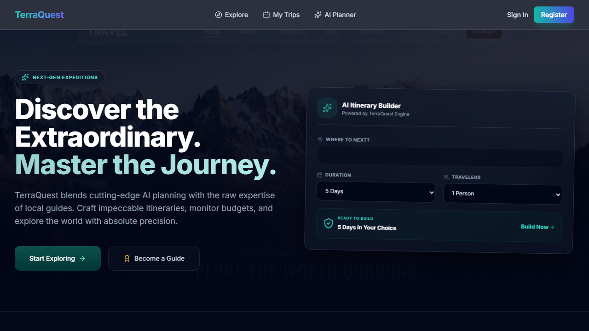
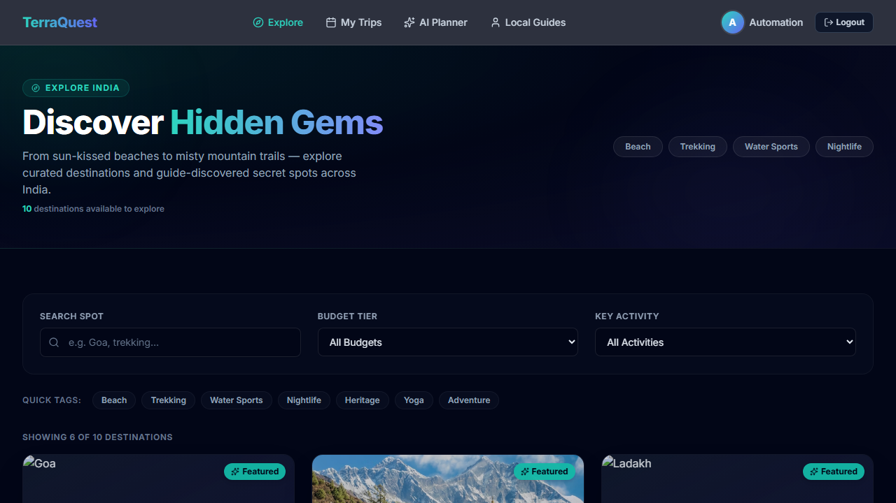
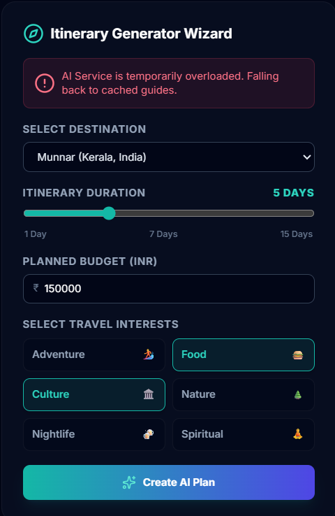
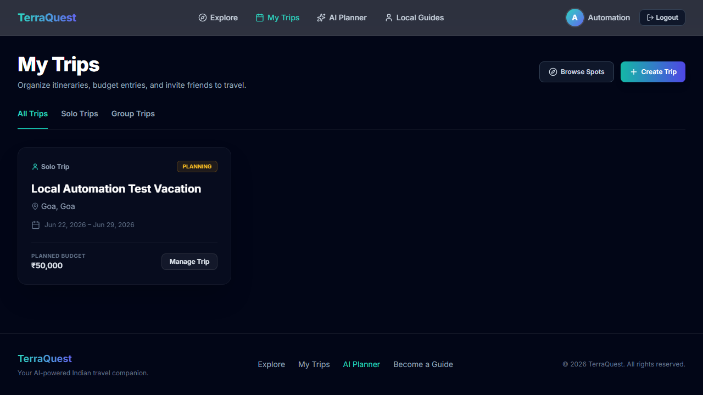

# TerraQuest 🌍✨

> **TerraQuest** (formerly Travell) is an AI-powered travel platform designed for exploring destinations, generating personalized itineraries, tracking budgets, and connecting with local guides.

Built using a modern glassmorphic aesthetic, the project features a decoupled architecture with a TypeScript/Express backend API and a Next.js 14 App Router frontend.

---

## 📸 Interface Showcases

### 1. Welcome Landing Page
Sleek, dark glassmorphic design featuring glowing ambient backgrounds, curating active destinations list, and parameter pre-population widgets.


### 2. Explore & Discover Board
Searchable destination cards leveraging Mongoose text indexing, quick tags filter, and budget tier queries.


### 3. AI Itinerary Planner
A parameters-wizard harnessing the **Google Gemini API** (`gemini-1.5-flash`) to draft customized daily itineraries, complete with responsive overlay notices and saved plan log histories.


### 4. My Trips & Expense Tracker
Collaborative travel dashboards detailing schedules, active members list, and nested budget entry logging.


---

## 🚀 Key Features

*   **🤖 AI Travel Planner**: Wizard form prompting GPT for itineraries based on budget levels, duration (1-30 days), and interests (Adventure, Food, Culture, etc.). Converts AI plans to trips instantly.
*   **📊 Budget Tracker & Expense Logger**: Nested expense controls with in-database aggregation pipelines recalculating balances (`Food`, `Stay`, `Transport`, `Activities`, `Other`).
*   **🧭 Destinations Search**: High-performance paginated lookups with text indexing, activity queries, and parsed budget ranges.
*   **👥 Local Guides & Polymorphic Reviews**: Direct directory for hiring guides. Polymorphic review models automatically trigger guide average ratings and total reviews recalculation upon submission.
*   **🔒 Multi-Role Auth**: Stateless JWT authentication sessions with role authorization guards (`traveler`, `guide`, `admin`).

---

## 🛠️ Technology Stack

### Backend API
*   **Core**: Express, TypeScript, Mongoose (MongoDB)
*   **Validation**: Zod (runtime env and payload parsing)
*   **Security & Auth**: JWT, bcrypt password hashing
*   **Testing**: Jest, Supertest, MongoDB Memory Server
*   **AI Service**: Google Generative AI SDK (Gemini API)

### Frontend App
*   **Core**: Next.js 14 (App Router), React 18, TypeScript, TailwindCSS
*   **State Management**: Zustand (global store with persistent local storage sync)
*   **Forms**: React Hook Form with Zod schema resolver
*   **Icons**: Lucide React

---

## 📁 Directory Structure

```
TerraQuest/
├── backend/
│   ├── src/
│   │   ├── config/             # DB connection & Zod Env validation
│   │   ├── models/             # Mongoose schemas (User, Trip, Review, etc.)
│   │   ├── middleware/         # Auth JWT verification, RBAC, error handlers
│   │   ├── services/           # OpenAI, Aggregation statistics, Ratings recalculation
│   │   ├── controllers/        # Express handlers (Auth, Trip, Reviews, etc.)
│   │   ├── routes/             # REST endpoint routing mounts
│   │   ├── app.ts              # Express application configuration
│   │   └── server.ts           # HTTP entry listener
│   └── tests/
│       ├── setup.ts            # MongoMemoryServer lifecycle hooks
│       ├── unit/               # Service & schema rules assertions
│       └── integration/        # Endpoint contract verification tests
│
├── frontend/
│   ├── app/                    # Next.js 14 App Router layout routes
│   ├── components/
│   │   ├── layouts/            # Header & Footer glassmorphic components
│   │   └── shared/             # Destination, Guide cards, and form utilities
│   ├── lib/                    # Axios API client interceptors
│   └── store/                  # Zustand Auth global store
```

---

## ⚙️ Setup & Installation

### Prerequisites
*   Node.js (v20 or higher)
*   MongoDB local instance or Atlas URI
*   Google Gemini API Key

### Backend Setup
1. Navigate to the backend directory:
   ```bash
   cd backend
   ```
2. Install dependencies:
   ```bash
   npm install
   ```
3. Set up environment variables in a `.env` file:
   ```env
   PORT=5000
   NODE_ENV=development
   MONGODB_URI=mongodb://localhost:27017/terraquest
   JWT_SECRET=your_super_secret_jwt_key_here
   JWT_EXPIRES_IN=7d
   FRONTEND_URL=http://localhost:3000
   GEMINI_API_KEY=your_gemini_api_key_here
   ```
4. Seed the destinations database and administrative default account:
   ```bash
   npm run seed
   npm run seed:admin
   ```
5. Run in development mode:
   ```bash
   npm run dev
   ```

### Frontend Setup
1. Navigate to the frontend directory:
   ```bash
   cd ../frontend
   ```
2. Install dependencies:
   ```bash
   npm install
   ```
3. Set up environment variables in a `.env.local` file:
   ```env
   NEXT_PUBLIC_API_URL=http://localhost:5000/api
   ```
4. Run in development mode:
   ```bash
   npm run dev
   ```
   Open [http://localhost:3000](http://localhost:3000) to access the application.

---

## 🧪 Testing

The backend includes a comprehensive unit and integration test suite utilizing Jest and `mongodb-memory-server` to run tests instantly in-memory without affecting your local database.

To execute the test suite:
```bash
cd backend
npm test
```

Currently, **90/90 tests are passing successfully**:
*   **Auth Services & Endpoints**: User registrations, JWT cookie logins, and administrative lookups.
*   **Trips & Budget Aggregations**: Mathematical spent vs remaining calculations.
*   **Polymorphic Reviews**: Ratings aggregation and Guide average rating updates.
*   **AI Planner API**: Gemini plan requests and fallback generation schema controls.
